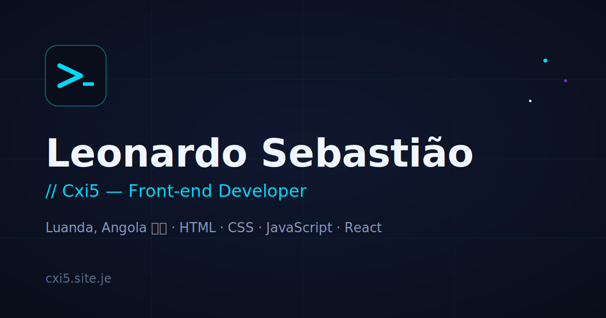

# Portfolio — Leonardo Sebastião Cxi5

Site pessoal estático, bilingue (PT/EN), sem framework e sem build step —
HTML puro servido diretamente. Apresenta quem sou, a stack que uso e os
projetos que construí.

**🔗 Live:** [cxi5.site.je](https://cxi5.site.je/)

---

## Páginas

- `index.html` — página principal: hero, secção "Quem sou" (com um bloco de
  código `class Cxi5 {}` como assinatura), stack e carrossel com os 4
  projetos em destaque.
- `projetos.html` — lista completa dos projetos, com descrição curta,
  tags de tecnologia, link para o projeto ao vivo e um botão "Ver descrição
  do projeto" que abre um modal com a descrição completa.
- `en/index.html`, `en/projetos.html` — versões em inglês das páginas
  acima (conteúdo próprio, não é tradução automática).
- `sitemap.xml` — mapa do site com as páginas PT/EN e as respetivas
  hreflang alternates.
- `google2493e96d81cc9262.html` — ficheiro de verificação de propriedade
  do Google Search Console.

## Stack

Sem framework e sem build step — cada página é um `.html` autossuficiente:

- **HTML5 + CSS3** (`style.css`, partilhado por todas as páginas)
- **JavaScript vanilla** (`main.js`, partilhado por todas as páginas)
- **Google Fonts** (Space Grotesk + JetBrains Mono)

## Funcionalidades (JS)

- **Tradução PT/EN** — troca instantânea de idioma via atributos
  `data-pt`/`data-en` em cada elemento, sem reload nem biblioteca de i18n.
- **Modal de descrição de projeto** — cada card em `projetos.html` tem um
  botão que abre um modal com a descrição completa do projeto (foco preso,
  fecho por `Esc`, clique fora ou botão). O botão e o modal existem
  **apenas** em `projetos.html`/`en/projetos.html` — no `index.html` os
  cards do carrossel ficam sem essa opção, para não expor um submenu
  expansível na página inicial.
- **Mood por projeto** — o modal muda de cor de destaque consoante o
  projeto aberto (NexDoc em azul-acinzentado neutro, LuxeStay em dourado
  quente, Soft Soluções em verde técnico, Guia do Terminal no ciano de
  assinatura do site), em vez de toda a página partilhar sempre a mesma
  paleta.
- **Animação matrix** de fundo na secção "Quem sou", via `<canvas>`,
  pausada automaticamente quando a aba não está visível
  (`visibilitychange`) para poupar performance.
- **Carrossel de projetos** no `index.html`, navegável por setas, arrasto
  ou teclado.
- **Animações de entrada ("reveal") ao scroll**, via `IntersectionObserver`.
- **Links de WhatsApp ofuscados** — o número é guardado em base64 e só é
  decodificado no browser, para dificultar a recolha automática por bots.

## SEO

- Meta tags completas (description, keywords, robots)
- Open Graph e Twitter Card, com `og-image.png` próprio
- Tags `hreflang` para as versões PT/EN
- `sitemap.xml` e ficheiro de verificação do Google Search Console
- Favicons em múltiplos formatos (`.ico`, `.png` 16/32, apple-touch-icon)